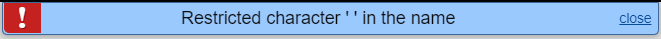
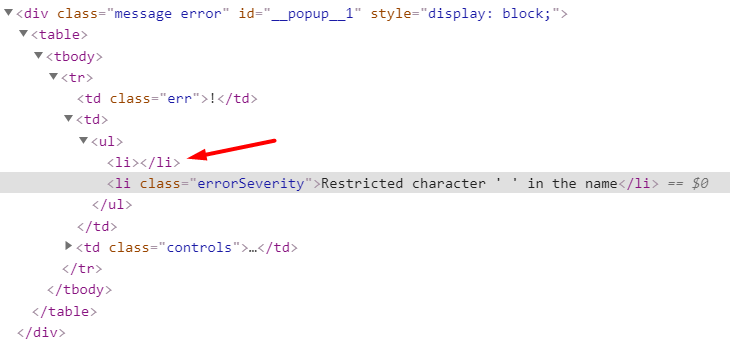
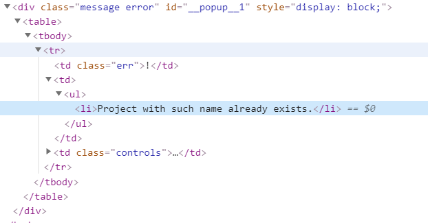
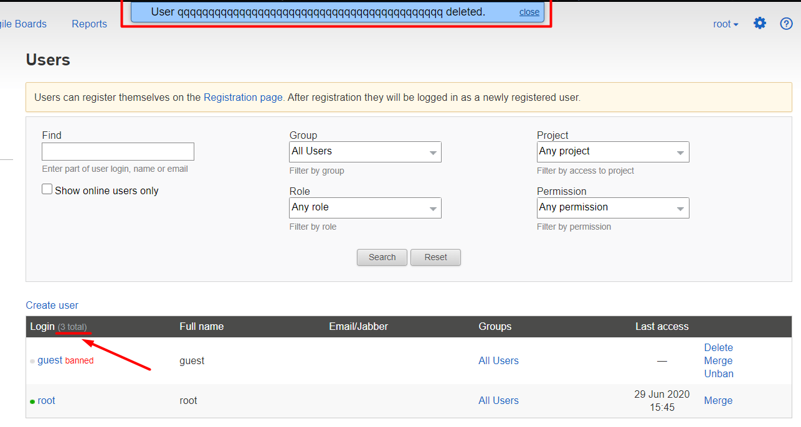

# Обнаруженные баги

#### Ограничения на логин

Ограничения на логин - это blacklist, а не whitelist, что порождает следующие баги:
* Логин может содержать любые невидимые юникодные символы, исключая обычный пробел
* Логин может содержать пробелы нулевой ширины
  * Это позволяет создавать логины визуально неотличимые друг от друга. Например: `ro&#8203;ot` и `root`.
  * Логин может состоять только из пробелов нулевой ширины. Это делает ссылку на редактирование пользователя в таблице пользователей невидимой и некликаемой, потому что ее текст - логин.
* Нулевой символ 0x00 может быть использован в логине, если отправлять запрос на создание пользователя не из браузера, а, например, при помощи curl. Браузеры (проверял на firefox, chrome) не смогут открыть страницу `/editUser/<login>` этого пользователя, потому что нулевой символ недопустим в url-е

#### Ограничения на длину

* Отсутствуют ограничения на длину полей Password, Email, Jabber. Длина этих полей ограничивается только максимальной длиной http-реквеста, 5MB.
* Отсутствуют ограничения на длину полей на бэкенде. Можно отправить http-реквест (например, при помощи curl), который задаст login и full name любой длины. Единственное ограничение - на длину http-реквеста, 5MB

#### Попап с ошибкой

Текст ошибки в попапе находится в html-списке, первый элемент которого всегда пустой.

Для воспроизведения:
* Попытаться создать пользователя с пробелом в логине
* Дождаться попапа об ошибке
* Посмотреть в его html:

Воспроизводится для всех ошибок на этой странице.

Это поведение не консистентно, некоторые сообщения об ошибках на других страницах отображаются без пустого элемента. Например при попытке создать проект с именем, состоящим из пробелов, на странице /createProject:

#### Остальное

* При попытке создать пользователя с логином `root` или `guest` выдается неправильное сообщение об ошибке. Ожидается `Value should be unique: login`, на самом деле: `Removing null is prohibited`
* Счетчик пользователей в заголовке таблицы пользователей не обновляется при удалениии юзеров. Для обновления нужно перезагрузить страницу. 
* Форма создания пользователей теряет возможность перемещаться по экрану при повторном открытии без перезагрузки страницы. Эту форму можно перемещать схватив мышкой за заголовок. Если открыть ее, нажать "Cancel" и открыть заново, то она перестанет перемещаться до перезагрузки страницы.
