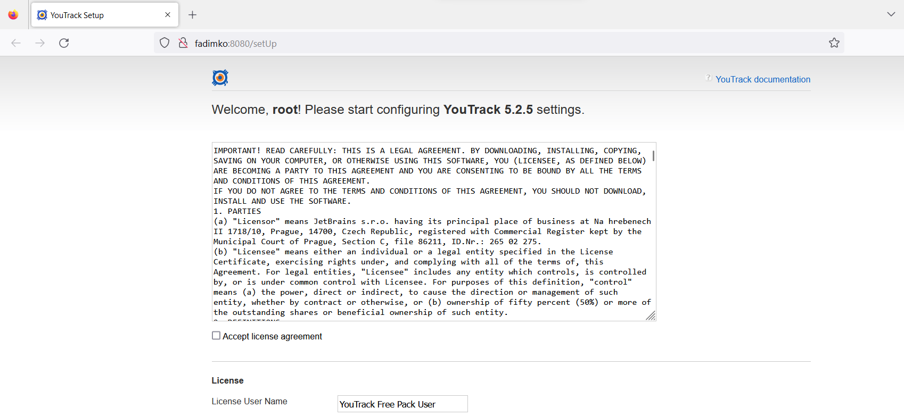

There are 2 projects in solution: `YouTrackApp` and `YouTrackTests`. YouTrackApp is a project to make starting and stopping youtrack easier, and YouTrackTests is a project with tests.

# YouTrackApp

## Start YouTrack
* Install [java](https://www.java.com/ru/download/)
* Download [youtrack-5.2.5-8823.jar](https://download.jetbrains.com/charisma/archive/youtrack-5.2.5-8823.jar)
* Create directory `<repo dir>/YoutrackApp/Resources` and put `youtrack-5.2.5-8823.jar` there
* Build and run YoutrackApp
* New tab in browser should open. Wait for it to load. It should look like this: 
* Done

## Stop YouTrack and clean up it's data
* Run `YoutrackApp.exe /StopCleanup` or `YoutrackApp.exe /StopCleanup /YoutrackJarPath <path>`

## Available arguments
```
/YoutrackJarPath <path>
    default = ".\Resources\youtrack-5.2.5-8823.jar"
/BaseUrl <url>
    default = "http://localhost"
/Port <port>
    default = "8080"
/HomeDirectory <dir>
    default = ".\YoutrackData"
/StopCleanup
/Help
```


# YoutrackTests
After Youtrack started you could run tests. Default parameter values should be fine. 

## Nunit parameters
```
--params=YoutrackAddress=http://<host>:<port>
    default = http://localhost:8080
--params==Browser=Firefox|Chrome
    default = Chrome
```
