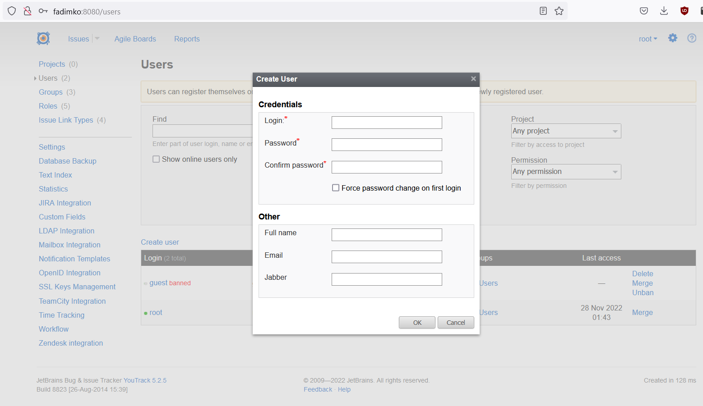

The page tests cover

User creation form

- UserCreationForm tests
    - Login
        - __ValidLoginEmptyFullName => OK__
            - One symbol
            - Ten symbols
            - Max length
            - Special characters
            - Plus symbol is not url encoded
            - Unicode characters in login
        - __FormDoesntAllowToTypeTooLongLogin => additional keystrokes ignored__
        - __ErrorBulbErrors => show error bulb__
            - Empty login
            - Login consists of spaces
        - __ErrorPopupErrors => show error popup__
            - Space at the start of login
            - Space at the end of login
            - Space in the middle of login
            - Login is '.'
            - Login is '..'
        - __NotAllowedToCreateUserWithNonUniqueLogin => show error popup__
            - Same logins
            - First login is lowercased, second is uppercased
            - First login is uppercased, second is lowercased
        - __NotAllowedToCreateUserWithRootAndGuestNames => show error popup__
            - login = "guest"
            - login = "root"
        - __NotAllowedToCreateUsersWithIdenticalLookingLogin => show error popup__
        - __WhitespacesNotAllowedInLogin => show error popup__
            - login = " "
            - login = " "
            - login = "?"
            - login = "login withwhitespace"
            - login = "login withwhitespace"
            - login = "login?withwhitespace"
            - login = "login withwhitespace"
            - login = ""
    - Password
        - __ValidPasswordAndConfirmation => OK__
            - One symbol password
            - Correct password
            - Maximum length password
            - Unicode characters in password
        - __NegativeTests => show error bulb__
            - No password, no confirmation
            - No password
            - No confirmation
            - Password and confirmation don't match
            - Confirmation is more than 50 characters
        - __TooLongPasswordReturnsError => show error bulb__
            - Password is > 50 characters long, password confirmation is empty
            - Password is > 50 characters long, password confirmation is of normal length
            - Password is > 50 characters long, password confirmation too
    - FullName
        - __ValidFullName => OK__
            - One symbol password
            - Some correct password
            - Maximum length password
            - Special characters in password
            - Unicode characters in password
        - __FormDoesntAllowToTypeTooLongFullName =>  additional keystrokes ignored__
    - Email/Jabber
        - __ValidEmail => OK__
            - One symbol
            - Correct email
            - Maximum length email
            - Special characters in email
            - Unicode characters in email
        - __TooLongEmail => additional keystrokes ignored__
        - __ValidJabber => OK__
            - One symbol jabber
            - Correct jabber
            - Maximum length jabber
            - Special characters in jabber
            - Unicode characters in jabber
        - __TooLongJabber => additional keystrokes ignored__
        - __EmailWithoutJabber => OK__
        - __JabberWithoutEmail => OK__
        - __NoEmailNoJabber => OK__
    - ForcePasswordChange
        - __ForcePasswordChange => password change form is displayed after login__
    - CharacterEscaping
        - __UrlSpecialCharactersAreEncoded => OK__
        - __HtmlTagsInLogin => get error popup__
            - '/' in login
            - '<' in login
            - '>' in login
        - __HtmlTagsInAllFieldsExceptLogin => OK__
        - __HtmlSpecialCharactersInAllFields => OK__
        - __HtmlSpecialCharactersInDefaultFullname => OK__
- UserCreation
    - __CreateUpToLimitUsers => OK__
- LicenceRestrictionsTests
    - __CreateUserLinkDisappearsAsUserLimitReached => user link disappears__
    - __CantOpenUserCreationFormFromPageOpenedBeforeUserLimitReached => error popup__
    - __CantCreateUserFromTheFormOpenedBeforeUserLimitReached => error popup__
    - __CanCreateNewUserAfterFreeingUserSlotByDeletingOne => OK__
    - __CanCreateNewUserAfterFreeingUserSlotByBanningOne => OK__
